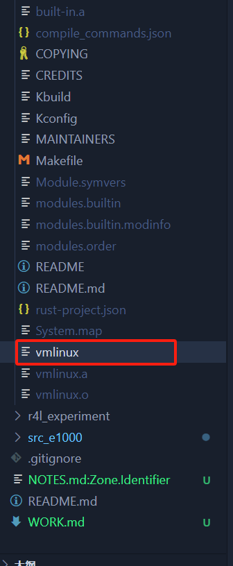
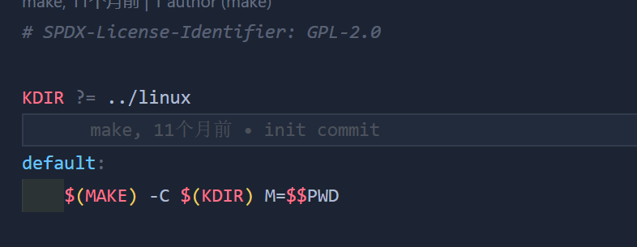
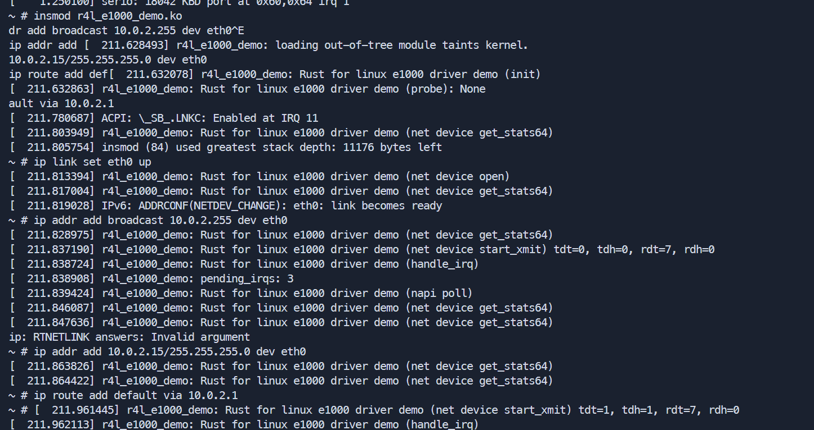
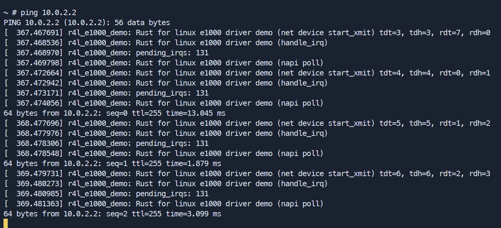
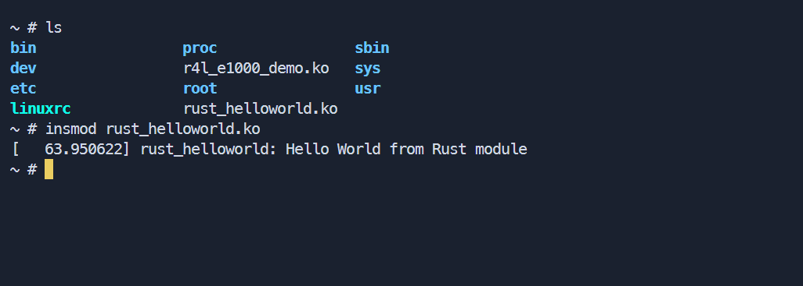
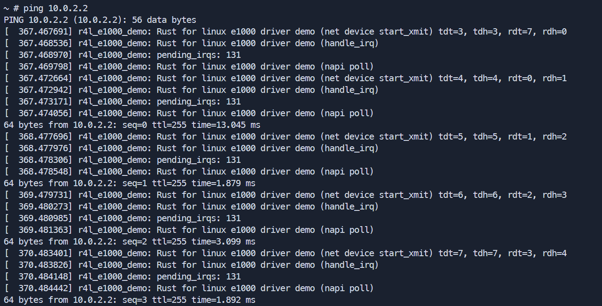
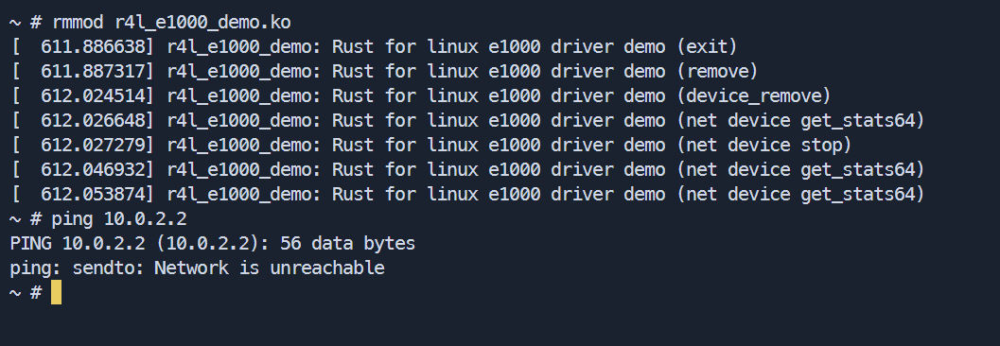
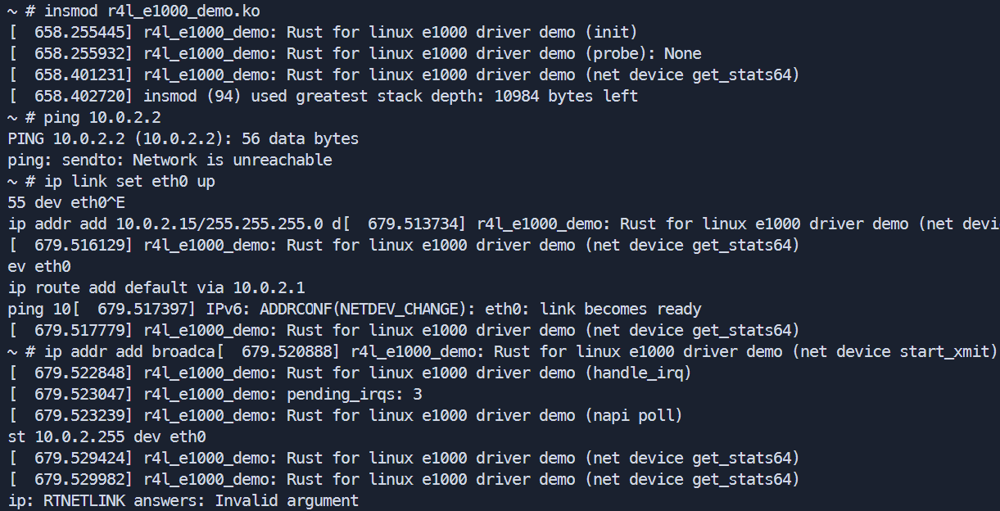
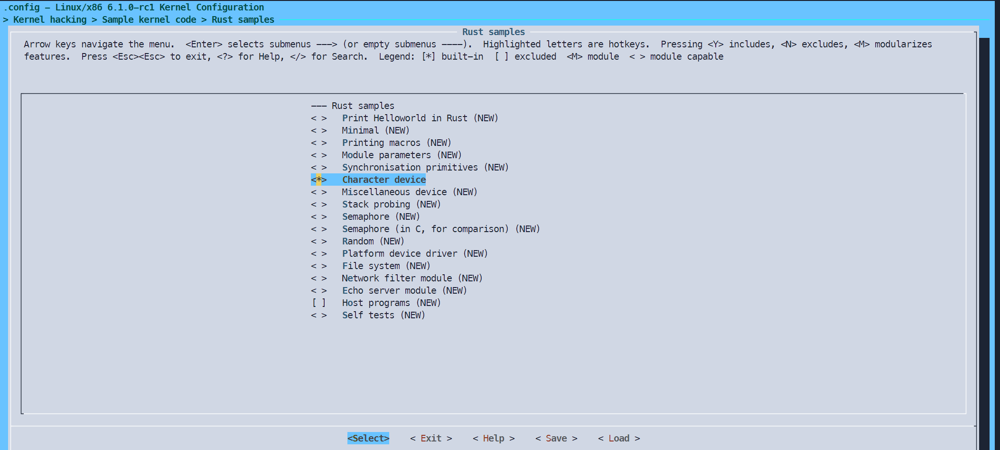
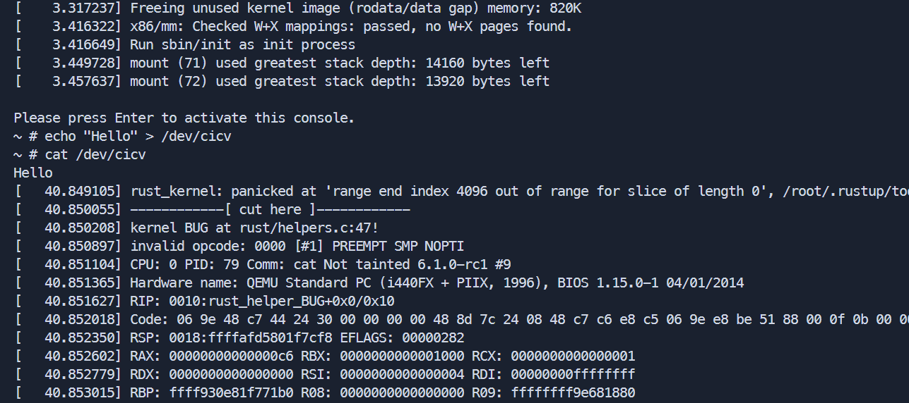

## 作业一

直接按照文档操作， 最终生成了 vmlinux



## 作业二

> 1、编译成内核模块，是在哪个文件中以哪条语句定义的？

在配置文件 src_e1000/Kbuild 中指定的:

```makefile
obj-m := r4l_e1000_demo.oo
```

> 2、该模块位于独立的文件夹内，却能编译成 Linux 内核模块，这叫做 out-of-tree module，请分析它是如何与内核代码产生联系的？

通过 src_e1000/Makefile 配置



> 3、添加 rust 的 1000 内核。



> 4、ping 10.0.2.2。



## 作业三

重新编译内核
将 helloworld 模块复制到虚拟机的 rootfs 中 ：



## 作业四

重新编译内核和 e1000, 启动 qemu，ping 10.0.2.2。



移除内核模块:



重新安装内核模块:



## 作业五

配置


运行结果


